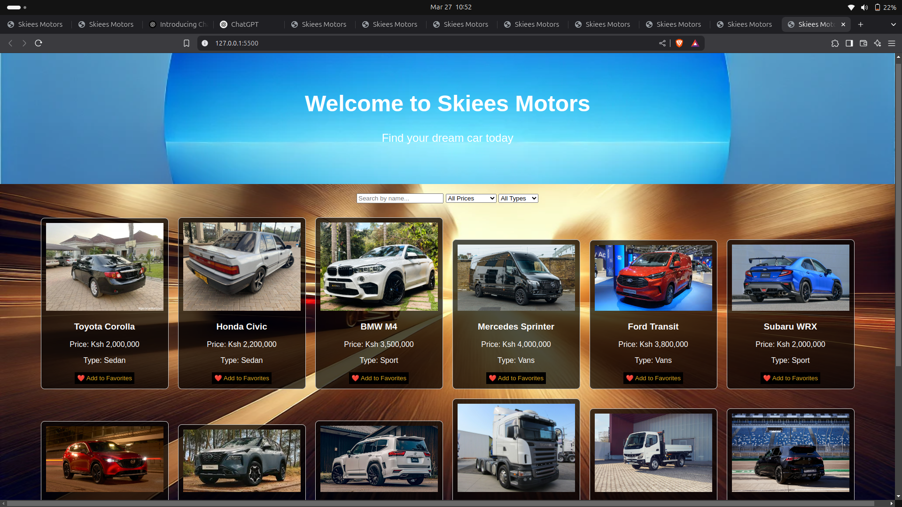

Skiees Motors 🚗 
Skiees Motors is a web-based car dealership  system that allows buyers to browse, search, and filter cars based on their preferences. 
It also fetches car data  and presents a well organized way.

📌 Features:
✅ Fetch and Display Cars – It can be abble to clearly fetch and display data.
✅ Search Functionality –   Buyers can easily navigate throughit while searching for desired cars.
✅ Filter by Price or Category – It can  help buyers and users to filter car listings based on price range and vehicle type (SUV, Sedan, sport, hutchback).
✅ Favorites List – Users can save cars to their favorites for later viewing.
✅ Responsive UI – The website is designed to work on desktops, tablets, and mobile devices.

🛠️ Technologies Used:
1.HTML – Structure of the web pages.

2.CSS – Styling and layout for an appealing UI.

3.JavaScript – Handles functions such as fetching and displaying data.

4.JSON – Stores car data.

5.Fetch API – Retrieves car data .

🏗️ Project Setup:
To run the project locally, follow these steps:

1️⃣ Clone the Repository
git clone https://github.com/kmwirigii/Skiees--Motors.git
2️⃣ Navigate into the Project Directory.
cd Skiees--Motors
3️⃣ Open the index.html File
Simply open the index.html file in a web browser to view the application.

🎯 How to Use:
🔎 Search for Cars – Use the search bar to quickly find a car by name.

🎚 Filter Cars – Select a price range and/or car type to filter results.

❤️ Save Favorites – Click the "Add to Favorites" button to save a car for later viewing.

🚀 Future Improvements
🔹 Add a backend using Node.js or Firebase to store and manage car data.
🔹 Implement user authentication so users can log in and save their favorites permanently.
🔹 Enhance the UI/UX with animations and better styling.

🤝 Contributions:
Contributions are welcome.If you would like to improve this project, follow these steps:

1.Fork the repository.

2.Create a new branch (git checkout -b feature-branch).

3.Make your changes and commit (git commit -m "Added a new feature").

4.Push to your forked repository (git push origin feature-branch).

5.Open a pull request.

📜 License:
This project is open-source and available under the MIT License.
